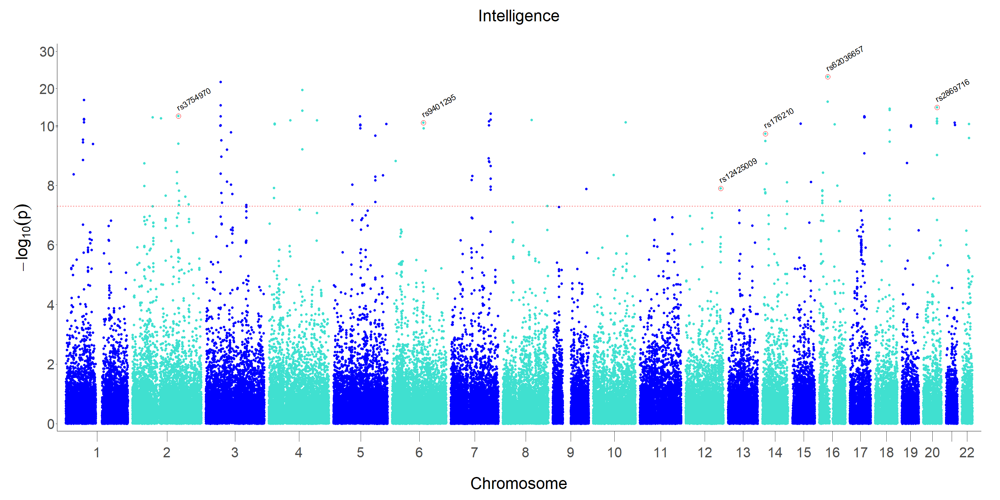
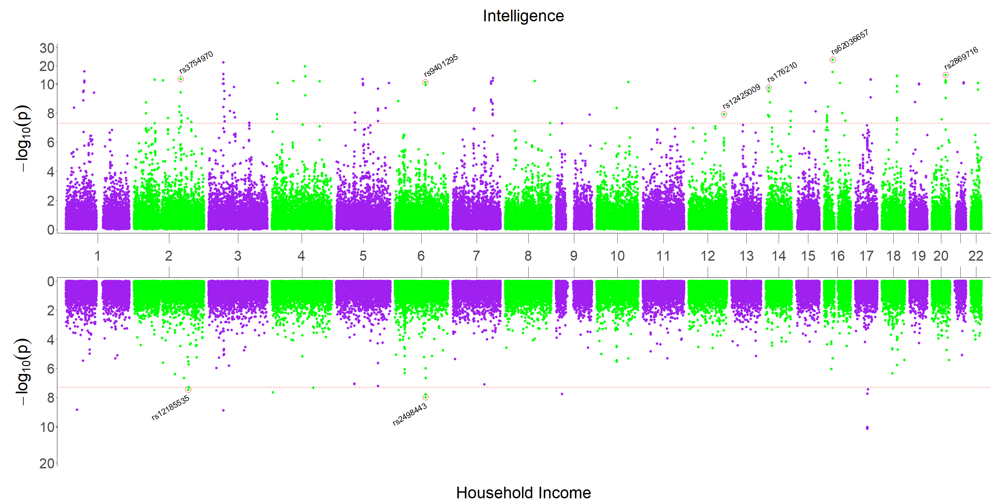
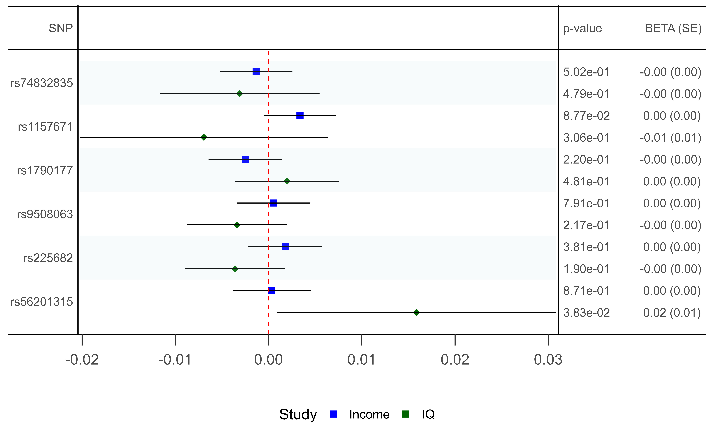
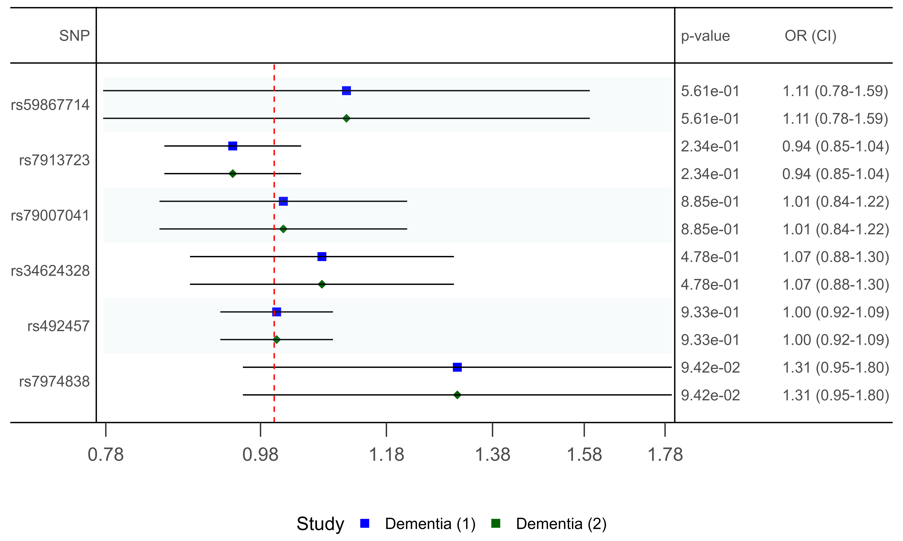

Introduction To MiamiR
================

Let’s load in the MiamiR package.

``` r
library(MiamiR)
#> 
#> 
#>     +-------------------------------------+
#>     |                MiamiR               |
#>     |                                     |
#>     |                                     |
#>     |   *           *                     |
#>     |   *           *         *           |
#>     |   *    *      *         *           |
#>     | * *    *      *    *    *     *     |
#>     | * *    *      *    *    *     *     |
#>     | * *    *      *    *    *     *     |
#>     | * * * * * * * * * * * * * * * * * * |
#>     | * * * * * * * * * * * * * * * * * * |
#>     | * * * * * * * * * * * * * * * * * * |
#>     +-------------------------------------+
#> 
#> 
#> Thank you for using MiamiR!
#> Citation not required, but greatly appreciated :)
#> Visit Github (https://github.com/CRON-Project/MiamiR) for requests, feedback, and info.
#> Visit www.theCRONproject.com for more data visualisation examples.
#> 
```

Here’s how to annotate the coordinates of your data with RSIDs for the
index SNPs on each chromosome - these will be added to the data frame in
a new column called Lab.

We will be using the Intelligence_Sum_Stats data frame which is part of
the MiamiR package and utilising the Annotate_Data() function to do
this - it will return a modified data frame called Labelled_Data

``` r
Labelled_Data <- Annotate_Data(Data = Intelligence_Sum_Stats,
                        Chromosome_Column = "CHROM",
                        Position_Column = "GENPOS", SNP_ID_Column = "ID",
                        PValue_Column = "P", Build = "HG19")
```

Let’s inspect the data before plotting:

``` r
print(head(Labelled_Data, n = 10))
#> # A tibble: 10 × 15
#>    SNP        UNIQUE_ID   CHR    POS A1    A2    EAF_HRC Zscore  stdBeta      SE
#>    <chr>      <time>    <dbl>  <dbl> <chr> <chr>   <dbl>  <dbl>    <dbl>   <dbl>
#>  1 rs1417896…    NA         2 3.99e7 a     g     0.969   -0.727 -5.76e-3 0.00792
#>  2 rs11896686    NA         2 1.80e8 t     g     0.899   -1.83  -8.34e-3 0.00455
#>  3 rs6428520     NA         1 8.98e7 t     c     0.432   -0.119 -3.30e-4 0.00277
#>  4 rs4687424     NA         3 1.93e8 t     c     0.894    0.712  3.16e-3 0.00443
#>  5 rs5277262…    NA         4 1.08e7 t     c     0.00302 -0.936 -2.73e-2 0.0292 
#>  6 rs595827      NA        11 1.24e8 t     c     0.309    3.50   1.04e-2 0.00296
#>  7 rs1436448…    NA         2 1.56e8 a     t     0.00202  0.501  1.79e-2 0.0356 
#>  8 rs2319468     NA         5 2.46e7 t     c     0.967   -0.692 -5.37e-3 0.00775
#>  9 rs354831      NA         9 8.91e7 t     c     0.786    1.04   3.51e-3 0.00337
#> 10 rs1501628…    NA        15 2.98e7 t     c     0.998   -0.865 -3.05e-2 0.0353 
#> # ℹ 5 more variables: P <dbl>, N_analyzed <dbl>, minINFO <dbl>,
#> #   EffectDirection <chr>, Lab <chr>
```

Here’s how to create a sole Manhattan plot of our labelled summary
statistics using the Single_Plot() function - it will return a plotting
object and a saved .jpg file.

``` r

#setwd("C:/Users/callumon/Miami_Package_R/MiamiR/docs")

Manhattan_Plot <- Single_Plot(Data = Labelled_Data,
                        Chromosome_Column = "CHROM",
                        Position_Column = "GENPOS", SNP_ID_Column = "ID",
                        PValue_Column = "P",
                        Title = "Intelligence",
                        Chromosome_Colours = c("blue", "turquoise"),
                        File_Name = "Manhattan_Plot")
```

``` r
# Your ggplot code here
print(Manhattan_Plot)
```



Here’s how to create a Miami plot of a pair of summary statistics using
the Miami_Plot() function - it will return a plotting object and a saved
.jpg file.

We will be using the Intelligence_Sum_Stats and
Household_Income_Sum_Stats data frames which are part of the MiamiR
package.

We have not annotated these data frames as they already have RS codes as
their SNP IDs and the MiamiR package will automatically detect this and
assign these to a newly created Lab column.

``` r

#setwd("C:/Users/callumon/Miami_Package_R/MiamiR/docs")

Miami_Plot <- Miami_Plot(Top_Data = Intelligence_Sum_Stats, Bottom_Data = Household_Income_Sum_Stats,
                       Top_Chromosome_Column = "CHROM",
                       Top_Position_Column = "GENPOS", Top_SNP_ID_Column = "ID",
                       Top_PValue_Column = "P",
                       Top_Colour_One = "green", Top_Colour_Two = "purple",
                       Bottom_Colour_One = "green", Bottom_Colour_Two = "purple",
                       Bottom_Chromosome_Column = "CHROM",
                       Bottom_Position_Column = "GENPOS", Bottom_SNP_ID_Column = "ID",
                       Bottom_PValue_Column = "P",
                       Top_Title = "Intelligence", Bottom_Title = "Household Income",
                       File_Name = "Miami_Plot", Width = 30, Height = 15, Quality = 900,
                       File_Type = "jpg")
```

``` r
# Open a new page for grid drawing
grid::grid.newpage()

# Draw the Miami_Plot grid object
grid::grid.draw(Miami_Plot)
```



The MiamiR package can also be used to inspect key SNPs in single or
multiple sets of GWAS summary statistics by using the Forest_Plot()
function.

Here’s how to create a Forest Plot centred around BETA values of key
SNPs from our previously described pair of summary statistics using the
Miami_Plot() function - it will return a plotting object and a saved
.jpg file.

``` r

#setwd("C:/Users/callumon/Miami_Package_R/MiamiR/docs")


Forest_Plot_SNPs_BETA <- Forest_Plot(Data_Sets = c("Household_Income_Sum_Stats", "Intelligence_Sum_Stats"),
                        Names = c("Income", "IQ"),
                        Model_Reference = FALSE,
                        Line_Space = 1.5,
                        Border_Space_Right = 40,
                        Border_Space_Left = 20,
                        Test_Statistic = "BETA", #could be OR
                        Display_Test_Stat_Se_Column = TRUE,
                        Display_P_Value_Column = TRUE,
                        X_Axis_Separation = 0.01,
                        Pre_Calculated_CIs = FALSE,
                        X_Axis_Text_Resolution = 2,
                        Legend_Title = "Study",
                        Left_Title = "SNP",
                        P_Value_Title = "p-value",
                        Test_Stat_Se_Title = "BETA (SE)",
                        Match_Allele_Direction = TRUE,
                        Match_Allele_Study = "Household_Income_Sum_Stats",
                        Selected_SNPs = c("rs74832835",  "rs1157671",   "rs1790177",
                                          "rs9508063",   "rs225682",  "rs56201315" ),
             File_Name = "Forest_Plot_Intelligence_Income", Width =10, Height = 6, Quality = 900,
                        File_Type = "jpg"
)
```



The MiamiR package also allows for the use of odds ratios (OR) as well,
by modifying the Test_Statistic argument in the Forest_Plot() function.

``` r


Forest_Plot_SNPs_OR <- Forest_Plot(Data_Sets = c("LbDementia_Sum_Stats", "LbDementia_Sum_Stats"),
                                     Names = c("Dementia (1)", "Dementia (2)"),
                                     Model_Reference = FALSE,
                                     Line_Space = 1.1,
                                     Border_Space_Left = 7,
                                     Border_Space_Right = 30,
                                     X_Axis_Text_Resolution = 2,
                                     Test_Statistic = "OR",
                                     Display_P_Value_Column = TRUE,
                                     Display_Test_Stat_CI_Column = TRUE,
                                     X_Axis_Separation = 0.2,
                                     Pre_Calculated_CIs = FALSE,
                                     Legend_Title = "Study",
                                     Left_Title = "SNP",
                                     P_Value_Title = "p-value",
                                     Test_Stat_Se_Title = "OR (CI)",
                                     Match_Allele_Direction = TRUE,
                                     Match_Allele_Study = "LbDementia_Sum_Stats",
                                     Selected_SNPs = c("rs59867714","rs7913723","rs79007041",
                                                       "rs34624328", "rs492457",
                                                       "rs7974838"  ),
                               File_Name = "Dementia", Width =10, Height = 6, Quality = 900,
                                     File_Type = "jpg"
)
```



The MiamiR package also allows for the same figures to be produced but
for covariate effects from the raw outputs of lm() or glm() models in
base R, when saved as objects and munged, using the Model_Munge()
function before using the Forest_Plot() function.

Here’s how to process both glm and lm model objects. We will be using
the Model and Model2 regression model objects which are part of the
MiamiR package, which are linear and logistic regression models of
Dementia diagnoses and BMI measures, respectively, based off of
simulated data called Fake_Demo_Data, also available in the MiamiR
package.

``` r

ModelSumGLM <- Model_Munge(Model_Object = "Model", Model_Type = "glm") #Dementia
ModelSumLM <- Model_Munge(Model_Object = "Model2",  Model_Type = "lm") # BMI
```

Let’s inspect the data before plotting:

``` r
print(ModelSumGLM)
#>    Covariate        OR           SE          P     group Reference
#> 2      Black 1.0043834 0.0192586204 0.82038675 Ethnicity     Asian
#> 3   Hispanic 0.9959696 0.0191532242 0.83304346 Ethnicity     Asian
#> 4      Other 0.9954373 0.0188039063 0.80790087 Ethnicity     Asian
#> 5      White 0.9965701 0.0186876810 0.85416478 Ethnicity     Asian
#> 6        Age 0.9998680 0.0002888248 0.64768179       Age      None
#> 7       Male 0.9760366 0.0120966015 0.04522139       Sex    Female
#> 8        BMI 0.9983169 0.0012295248 0.17098721       BMI      None
#> 9   Suburban 0.9879690 0.0147833635 0.41312323  Location     Rural
#> 10     Urban 1.0330746 0.0149870916 0.03015565  Location     Rural
print(ModelSumLM)
#>    Covariate         BETA          SE         P     group Reference
#> 2      Black  0.133180297 0.497341325 0.7889210 Ethnicity     Asian
#> 3   Hispanic -0.236406456 0.494578604 0.6327588 Ethnicity     Asian
#> 4      Other  0.491017257 0.485367263 0.3119571 Ethnicity     Asian
#> 5      White -0.090114751 0.482601835 0.8519130 Ethnicity     Asian
#> 6        Age  0.002009237 0.007459302 0.7877089       Age      None
#> 7       Male -0.190246954 0.312965313 0.5434031       Sex    Female
#> 8   Dementia -1.123403862 0.819983063 0.1709872  Dementia      None
#> 9   Suburban  0.205108285 0.381848209 0.5912874  Location     Rural
#> 10     Urban  0.613622574 0.387465677 0.1135854  Location     Rural
```

Now let’s plot the covariate effects from the munged linear model data
frame, indicating that we are using a munged model object by setting the
Model_Reference argument to TRUE in the Forest_Plot() function.

``` r

#setwd("C:/Users/callumon/Miami_Package_R/MiamiR/docs")


Forest_Plot_Model_LM <- Forest_Plot(Data_Sets = c("ModelSumLM", "ModelSumLM"),
                                     Names = c("BMI LM (1)", "BMI LM (2)"),
                                     Model_Reference = TRUE,
                                     Test_Statistic = "BETA", #could be OR
                                     Display_P_Value_Column = TRUE,
                                     Display_Test_Stat_Se_Column = TRUE,
                                     X_Axis_Separation = 0.8,
                                     Border_Space_Left = 30,
                                     Border_Space_Right = 75,
                                     Strips = TRUE,
                                     Pre_Calculated_CIs = FALSE,
                                     Legend_Title = "Model",
                                     Left_Title = "Covariate",
                                     Test_Stat_Se_Title = "BETA (SE)",
                         File_Name = "Forest_Plot_LM", Width =10, Height = 6, Quality = 900,
                                     File_Type = "jpg"
)
```


The MiamiR package also formats model plots based off of OR test
statistics as well. Let’s plot the glm, again via modifying the
Test_Statistic argument in the Forest_Plot function.

``` r

#setwd("C:/Users/callumon/Miami_Package_R/MiamiR/docs")


Forest_Plot_Model_GLM <- Forest_Plot(Data_Sets = c("ModelSumGLM", "ModelSumGLM"),
                        Names = c("Dementia GLM (1)", "Dementia GLM (2)"),
                        Model_Reference = TRUE,
                        Test_Statistic = "OR",
                        X_Axis_Text_Resolution = 2,
                        Border_Space_Left = 2.8,
                        Border_Space_Right = 4.7,
                        Display_Test_Stat_CI_Column = TRUE,
                        Display_P_Value_Column = TRUE,
                        X_Axis_Separation = 0.02,
                        Pre_Calculated_CIs = FALSE,
                        Legend_Title = "Model",
                        Left_Title = "Covariate",
                        P_Value_Title = "p-value",
                        Test_Stat_Se_Title = "OR (CI)",
                        File_Name = "Forest_Plot_GLM", Width =10, Height = 6, Quality = 900,
                        File_Type = "jpg"
)
```


