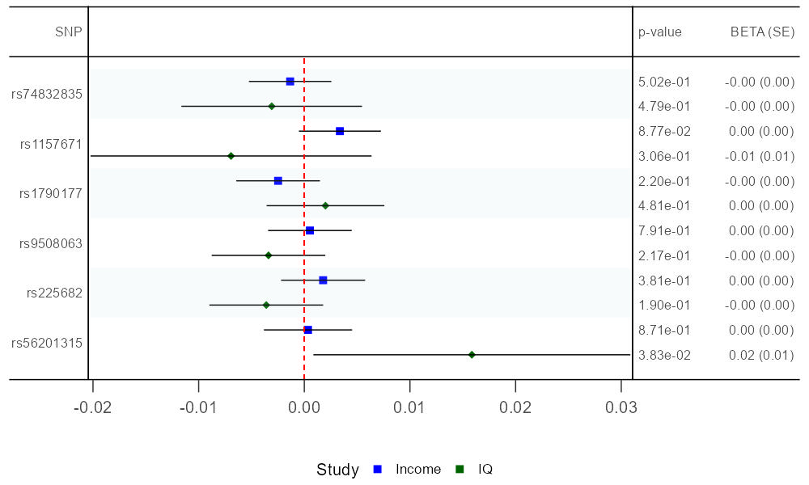
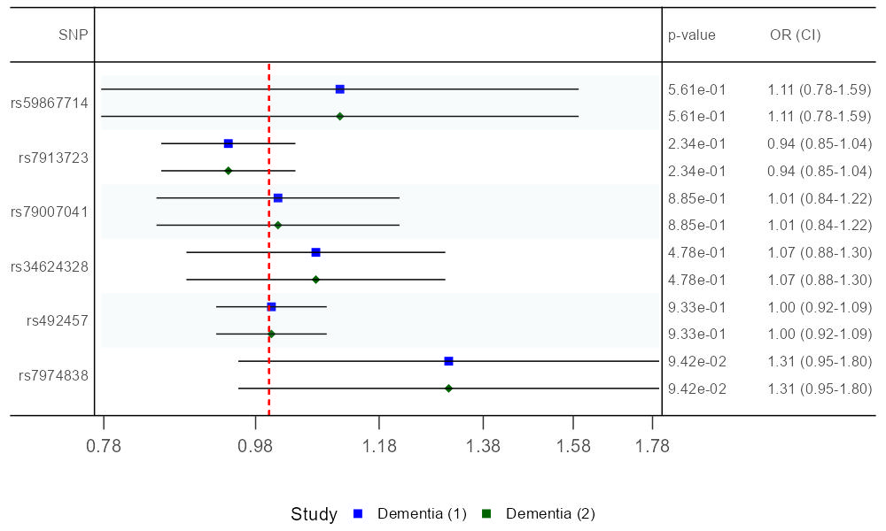
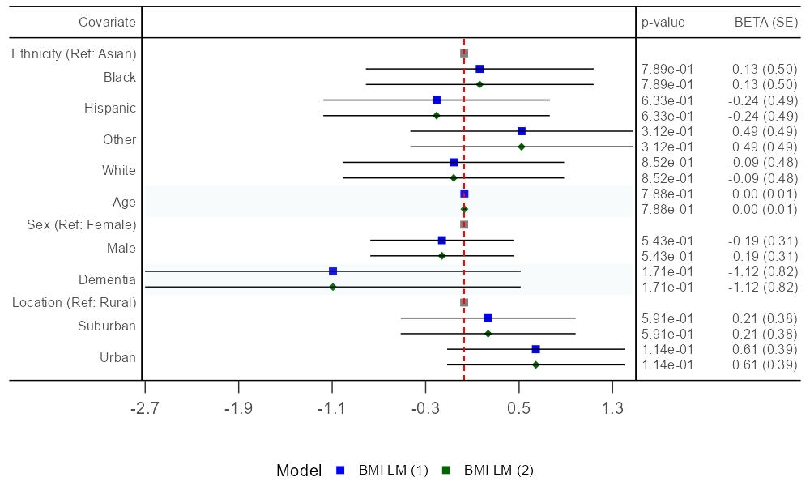
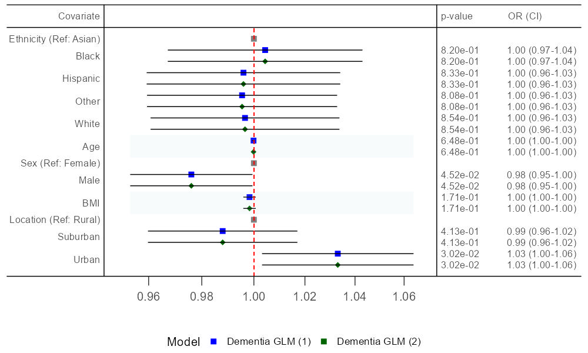

```{r, include = FALSE}

knitr::opts_chunk$set(
  collapse = TRUE,
  comment = "#>"
)

```

Let's load in the MiamiR package, complete with extensive documentation and functionality. A web app version is also available at: TBC

```{r setup, message=TRUE}

library(MiamiR)

```

Here's how to create a single Manhattan plot of summary statistics using the Single_Plot() function from MiamiR.

This function will return a plot object which we'll manually save to a .jpg file in the vignettes directory of the package for future use. Initially, all default settings will be used.

```{r, results="hide", warning = FALSE, message = TRUE}

setwd("C:/Users/callumon/Miami_Package_R/MiamiR/vignettes")

Manhattan_Plot <- Single_Plot(Data = Intelligence_Sum_Stats)

ggplot2::ggsave("Intelligence_Plot.jpg", plot = Manhattan_Plot, width = 30,
                 height = 15, units = "in", dpi = 100)

```
Let's inspect our saved plot.

```{r, results="hide", warning = FALSE, message = FALSE,  fig.width=30, fig.height=15, dpi=300, out.width="100%"}

knitr::include_graphics("C:/Users/callumon/Miami_Package_R/MiamiR/vignettes/Intelligence_Plot.jpg")

```

The Single_Plot() function from MiamiR also allows for a range of customisation. Here is a limited example.

Note; running ?Single_Plot() or ? for any function in MiamiR will provide documentation on all functionality available and information on any in-house datasets used.

```{r, results="hide", warning = FALSE, message = TRUE}

setwd("C:/Users/callumon/Miami_Package_R/MiamiR/vignettes")

Manhattan_Plot <- Single_Plot(Data = Intelligence_Sum_Stats, X_Axis_Title = "Region", Title = "Custom Plot", Label_Height = 15, Anchor_Label = "centre", 
                              Label_Angle = 90, Chromosome_Colours = c("red", "orange"), Colour_Of_Index = "blue", Diamond_Index = T)

ggplot2::ggsave("Intelligence_Plot_Custom.jpg", plot = Manhattan_Plot, width = 30,
                 height = 15, units = "in", dpi = 100)

```
Let's inspect our saved plot.

```{r, results="hide", warning = FALSE, message = FALSE,  fig.width=30, fig.height=15, dpi=300, out.width="100%"}

setwd("C:/Users/callumon/Miami_Package_R/MiamiR/vignettes")

knitr::include_graphics("C:/Users/callumon/Miami_Package_R/MiamiR/vignettes/Intelligence_Plot_Custom.jpg")

```

Files can also be fed in for all MiamiR functions using variables containing a file path or a raw file path, in addition to multiple files or environment objects, whilst allowing for identical functionality.

Here, raw file paths for the above summary statistics are used alongside another set based on a household income GWAS, with extra customisation demonstrated as well.

```{r, results="hide", warning = FALSE, message = TRUE}

setwd("C:/Users/callumon/Miami_Package_R/MiamiR/vignettes")


Sum_Stats <- c("C:/Users/callumon/Miami_Package_R/MiamiR/Example_Data_Raw/Intelligence_Sum_Stats.txt",
               "C:/Users/callumon/Miami_Package_R/MiamiR/Example_Data_Raw/Household_Income_Sum_Stats.txt")


Manhattan_Plot <- Single_Plot(Data = Sum_Stats, Label_Angle = 60, Label_Colour = "grey", Sig_Line_Type = "solid",
                              Chromosome_Colours = c("darkgreen", "turquoise"), Condense_Scale = F )


#Save names as looping to display later

output_files <- c()
for (plot_name in names(Manhattan_Plot)) {
  file_path <- paste0(plot_name, ".jpg")
  ggplot2::ggsave(
    filename = file_path,
    plot = Manhattan_Plot[[plot_name]],
    width = 30, height = 15, units = "in", dpi = 100
  )
  output_files <- c(output_files, file_path)
}

```
Let's inspect our saved plots:

```{r, results="hide", warning = FALSE, message = FALSE,  fig.width=30, fig.height=15, dpi=100, out.width="100%"}

setwd("C:/Users/callumon/Miami_Package_R/MiamiR/vignettes")
knitr::include_graphics(output_files)

```

There is also a Regional_Plot() function built around the above functionality, which has unique features in addition to seamlessly inheriting the Single_Plot() arguments to produce annotated regional plots. 

Here is how to run the function, which automatically ascertains regions of interest, with this example focusing on key regions in chromosomes 10 and 22 of the intelligence GWAS summary statistics.

We will also save all generated objects as correctly sized images with guide measures also returned by the function and supplied as part of the plot objects. 

Although defaults are suitable it is very important to specify the correct genomic build (in this case HG19) for accurate recombination and gene annotation tracks/overlays, in addition to queried LD.

```{r, results="hide", warning = FALSE, message = TRUE}

  setwd("C:/Users/callumon/Miami_Package_R/MiamiR/vignettes")

  Regional_Plots <- Regional_Plot(Data = Intelligence_Sum_Stats, Chromosomes = c(10,22), Genome_Build = "grch37")

  for (plot_name in names(Regional_Plots)) {
  plot <- Regional_Plots[[plot_name]]
  file_safe <- gsub("[^A-Za-z0-9]", "_", plot_name)
  filename <- paste0(file_safe, ".jpg")
  height_to_use <- attr(plot, "dynamic_height")
  if (is.null(height_to_use)) height_to_use <- 30

  setwd("C:/Users/callumon/Miami_Package_R/MiamiR/vignettes")
  
  ggplot2::ggsave(
    filename = filename,
    plot = plot,
    width = 30,
    height = height_to_use,   #nice divide by exon size to get ratio
    units = "in",
    dpi = 100,
    limitsize = FALSE
  )
  
}

```
Let's inspect our regional plots for these chromosomes.

```{r, results="hide", warning = FALSE, message = FALSE,  fig.width=30, fig.height=15, dpi=100, out.width="100%"}

  setwd("C:/Users/callumon/Miami_Package_R/MiamiR/vignettes")
  
  img_dir <- "C:/Users/callumon/Miami_Package_R/MiamiR/vignettes"
  
  # List files that end with 'Regional_Plot.jpg'
  img_paths <- list.files(
    path = img_dir,
    pattern = "Regional_Plot\\.jpg$",  # exact match
    recursive = TRUE,
    full.names = TRUE
  )
  
  # Sort by modification time (oldest first)
  img_paths <- img_paths[order(file.info(img_paths)$mtime)]
  
  # Display all matching plots
  knitr::include_graphics(img_paths)

```

One key customisation of the Regional_Plot() function is the ability to query for LD values around the lead SNP (with settings available for build, population etc.) and colour points in the top panel accordingly. 

For simplicity and speed let's just focus on the single chromosome 22 peak. Please bear in mind that querying an API is slow and may not always contain data pertaining to your particular set of SNPs. 

It is often better to produce your own LD matrix using tools such as PLINK2, the results of which can also be fed in to this package (FUTURE/TBC).

```{r, results="hide", warning = FALSE, message = TRUE}

  setwd("C:/Users/callumon/Miami_Package_R/MiamiR/vignettes")

  Regional_Plots <- Regional_Plot(Data = Intelligence_Sum_Stats, Auto_LD = TRUE, Chromosomes = c(22), Genome_Build = "grch37", 
                                  Gene_Biotype = c("coding", "snorna"),  Gene_Biotype_Colour = c("red", "green" ),
                                  Sense_Arrow_Colour = "darkorange", Gene_Structure_Size_Exons = 20, Gene_Legend_Location = "Top Left",
                                  Gene_Legend_Title = "Categories", Y_Axis_Title = "LOG10Pvalue", Diamond_Index_Size = 20)

  setwd("C:/Users/callumon/Miami_Package_R/MiamiR/vignettes")

  for (plot_name in names(Regional_Plots)) {
  plot <- Regional_Plots[[plot_name]]
  file_safe <- gsub("[^A-Za-z0-9]", "_", plot_name)
  filename <- paste0(file_safe, "_LD", ".jpg")
  height_to_use <- attr(plot, "dynamic_height")
  if (is.null(height_to_use)) height_to_use <- 30

  ggplot2::ggsave(
    filename = filename,
    plot = plot,
    width = 30,
    height = height_to_use,   #nice divide by exon size to get ratio
    units = "in",
    dpi = 100,
    limitsize = FALSE
  )
  
}

```

Let's have a look at our LD annotated plot with significant customisation.


```{r, results="hide", warning = FALSE, message = FALSE,  fig.width=30, fig.height=15, dpi=100, out.width="100%"}

  setwd("C:/Users/callumon/Miami_Package_R/MiamiR/vignettes")
  
  img_dir <- "C:/Users/callumon/Miami_Package_R/MiamiR/vignettes"
  
  # List files that end with 'Regional_Plot.jpg'
  img_paths <- list.files(
    path = img_dir,
    pattern = "Regional_Plot_LD\\.jpg$",  # exact match
    recursive = TRUE,
    full.names = TRUE
  )
  
  # Sort by modification time (oldest first)
  img_paths <- img_paths[order(file.info(img_paths)$mtime)]
  
  # Display all matching plots
  knitr::include_graphics(img_paths)
  
```


We can also use the MiamiR package to create a Miami plot of a pair of summary statistics using the Miami_Plot() function.

We will be using the Intelligence_Sum_Stats and Household_Income_Sum_Stats environmental objects which are part of the MiamiR package.

We have not annotated these data frames as they already have RS codes as their SNP IDs and the MiamiR package will automatically detect this and assign these to a newly created Lab column.


```{r, results="hide", warning = FALSE, message = FALSE}

Miami_Plot <- Miami_Plot(Top_Data = Intelligence_Sum_Stats, Bottom_Data = Household_Income_Sum_Stats)
                
```


```{r, results="hide", warning = FALSE, message = FALSE,  fig.width=30, fig.height=15, dpi=100, out.width="100%"}
# Open a new page for grid drawing
grid::grid.newpage()

# Draw the Miami_Plot grid object
grid::grid.draw(Miami_Plot)

```


Let's remove these before proceeding

```{r, results="hide", warning = FALSE, message = FALSE}

  
    setwd("C:/Users/callumon/Miami_Package_R/MiamiR/vignettes")

  img_dir <- "C:/Users/callumon/Miami_Package_R/MiamiR/vignettes"
  
# Remove all .jpg files after displaying
all_jpgs <- list.files(
  path = img_dir,
  pattern = "\\.jpg$",
  recursive = TRUE,
  full.names = TRUE
)

invisible(file.remove(all_jpgs))


```


The MiamiR package can also be used to inspect key SNPs in single or multiple sets of GWAS summary statistics by using the Forest_Plot() function.

Here's how to create a Forest Plot centred around BETA values of key SNPs from our previously described pair of summary statistics using the Miami_Plot() function - it will return a plotting object and a saved .jpg file.

```{r, results="hide", warning = FALSE, message = FALSE}

#setwd("C:/Users/callumon/Miami_Package_R/MiamiR/docs")
setwd("C:/Users/callumon/Miami_Package_R/MiamiR/vignettes")

Forest_Plot_SNPs_BETA <- Forest_Plot(Data_Sets = c("Household_Income_Sum_Stats", "Intelligence_Sum_Stats"),
                        Names = c("Income", "IQ"),
                        Model_Reference = FALSE,
                        Line_Space = 1.5,
                        Test_Statistic = "BETA", #could be OR
                        Display_Test_Stat_Se_Column = TRUE,
                        Display_P_Value_Column = TRUE,
                        X_Axis_Separation = 0.01,
                        Pre_Calculated_CIs = FALSE,
                        X_Axis_Text_Resolution = 2,
                        Legend_Title = "Study",
                        Left_Title = "SNP",
                        P_Value_Title = "p-value",
                        Test_Stat_Se_Title = "BETA (SE)",
                        Match_Allele_Direction = TRUE,
                        Match_Allele_Study = "Household_Income_Sum_Stats",
                        Selected_SNPs = c("rs74832835",  "rs1157671",   "rs1790177",
                                          "rs9508063",   "rs225682",  "rs56201315" ),
             File_Name = "Forest_Plot_Intelligence_Income", Width =10, Height = 6, Quality = 100,
                        File_Type = "jpg"
)

```

```{r echo=FALSE, fig.fullwidth=TRUE,  out.width = "675px"}
# Include the saved image in the document
  # Set to match saved height


```

The MiamiR package also allows for the use of odds ratios (OR) as well, by modifying the Test_Statistic argument in the Forest_Plot() function.

```{r, results="hide", warning = FALSE, message = FALSE}

setwd("C:/Users/callumon/Miami_Package_R/MiamiR/vignettes")


Forest_Plot_SNPs_OR <- Forest_Plot(Data_Sets = c("LbDementia_Sum_Stats", "LbDementia_Sum_Stats"),
                                     Names = c("Dementia (1)", "Dementia (2)"),
                                     Model_Reference = FALSE,
                                     Line_Space = 1.1,
                                     X_Axis_Text_Resolution = 2,
                                     Test_Statistic = "OR",
                                     Display_P_Value_Column = TRUE,
                                     Display_Test_Stat_CI_Column = TRUE,
                                     X_Axis_Separation = 0.2,
                                     Pre_Calculated_CIs = FALSE,
                                     Legend_Title = "Study",
                                     Left_Title = "SNP",
                                     P_Value_Title = "p-value",
                                     Test_Stat_Se_Title = "OR (CI)",
                                     Match_Allele_Direction = TRUE,
                                     Match_Allele_Study = "LbDementia_Sum_Stats",
                                     Selected_SNPs = c("rs59867714","rs7913723","rs79007041",
                                                       "rs34624328", "rs492457",
                                                       "rs7974838"  ),
                               File_Name = "Dementia", Width =10, Height = 6, Quality = 100,
                                     File_Type = "jpg"
)


```

```{r echo=FALSE, fig.fullwidth=TRUE,  out.width = "675px"}


# Include the saved image in the document
  # Set to match saved height


```

The MiamiR package also allows for the same figures to be produced but for covariate effects from the raw outputs of lm() or glm() models in base R, when saved as objects and munged, using the Model_Munge() function before using the Forest_Plot() function.

Here's how to process both glm and lm model objects. We will be using the Model and Model2 regression model objects which are part of the MiamiR package, which are linear and logistic regression models of Dementia diagnoses and BMI measures, respectively, based off of simulated data called Fake_Demo_Data, also available in the MiamiR package.

```{r, results="hide", warning = FALSE, message = FALSE}

ModelSumGLM <- Model_Munge(Model_Object = "Model", Model_Type = "glm") #Dementia
ModelSumLM <- Model_Munge(Model_Object = "Model2",  Model_Type = "lm") # BMI
```

Let's inspect the data before plotting:

```{r}
print(ModelSumGLM)
print(ModelSumLM)
```

Now let's plot the covariate effects from the munged linear model data frame, indicating that we are using a munged model object by setting the Model_Reference argument to TRUE in the Forest_Plot() function.

```{r, results="hide", warning = FALSE, message = FALSE}

#setwd("C:/Users/callumon/Miami_Package_R/MiamiR/docs")

setwd("C:/Users/callumon/Miami_Package_R/MiamiR/vignettes")

Forest_Plot_Model_LM <- Forest_Plot(Data_Sets = c("ModelSumLM", "ModelSumLM"),
                                     Names = c("BMI LM (1)", "BMI LM (2)"),
                                     Model_Reference = TRUE,
                                     Test_Statistic = "BETA", #could be OR
                                     Display_P_Value_Column = TRUE,
                                     Display_Test_Stat_Se_Column = TRUE,
                                     X_Axis_Separation = 0.8,
                                     Strips = TRUE,
                                     Pre_Calculated_CIs = FALSE,
                                     Legend_Title = "Model",
                                     Left_Title = "Covariate",
                                     Test_Stat_Se_Title = "BETA (SE)",
                         File_Name = "Forest_Plot_LM", Width =10, Height = 6, Quality = 100,
                                     File_Type = "jpg"
)

```

```{r echo=FALSE, fig.fullwidth=TRUE,  out.width = "675px"}


# Include the saved image in the document
  # Set to match saved height


```

The MiamiR package also formats model plots based off of OR test statistics as well. Let's plot the glm, again via modifying the Test_Statistic argument in the Forest_Plot function.

```{r, results="hide", warning = FALSE, message = FALSE}

#setwd("C:/Users/callumon/Miami_Package_R/MiamiR/docs")
setwd("C:/Users/callumon/Miami_Package_R/MiamiR/vignettes")

Forest_Plot_Model_GLM <- Forest_Plot(Data_Sets = c("ModelSumGLM", "ModelSumGLM"),
                        Names = c("Dementia GLM (1)", "Dementia GLM (2)"),
                        Model_Reference = TRUE,
                        Test_Statistic = "OR",
                        X_Axis_Text_Resolution = 2,
                        Display_Test_Stat_CI_Column = TRUE,
                        Display_P_Value_Column = TRUE,
                        X_Axis_Separation = 0.02,
                        Pre_Calculated_CIs = FALSE,
                        Legend_Title = "Model",
                        Left_Title = "Covariate",
                        P_Value_Title = "p-value",
                        Test_Stat_Se_Title = "OR (CI)",
                        File_Name = "Forest_Plot_GLM", Width =10, Height = 6, Quality = 100,
                        File_Type = "jpg"
)


```

```{r echo=FALSE, fig.fullwidth=TRUE,  out.width = "675px"}


# Include the saved image in the document
  # Set to match saved height


```


Here's how to annotate the coordinates of your data with RSIDs for the index SNPs on each chromosome - these will be added to the data frame in a new column called Lab.

We will be using the Intelligence_Sum_Stats data frame which is part of the MiamiR package and utilising the Annotate_Data() function to do this - it will return a modified data frame called Labelled_Data

```{r, results="hide", warning = FALSE, message = FALSE}
Labelled_Data <- Annotate_Data(Data = Intelligence_Sum_Stats,
                        Chromosome_Column = "CHROM",
                        Position_Column = "GENPOS", SNP_ID_Column = "ID",
                        PValue_Column = "P", Build = "HG19")


```

Let's inspect the data before plotting:

```{r}
print(head(Labelled_Data, n = 10))
```
